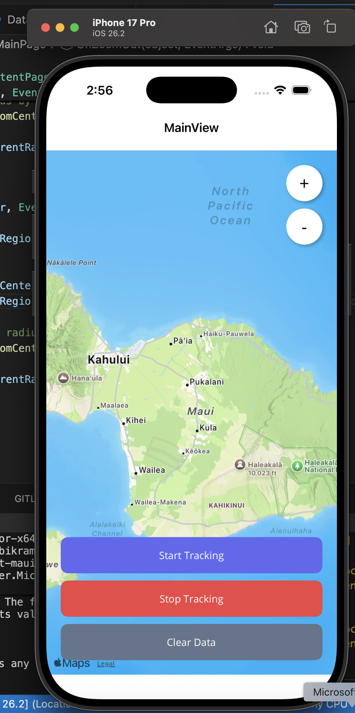

# Location Tracker - .NET MAUI Heat Map Application

A cross-platform location tracking application built with .NET MAUI that visualizes user movement as a heat map. The app tracks GPS coordinates, stores them in a local SQLite database, and displays them as blue circular overlays on an interactive map.


## Features

- **Real-time Location Tracking**: Captures GPS coordinates every 5 seconds
- **Heat Map Visualization**: Displays tracked locations as semi-transparent blue circles on a map
- **SQLite Database**: Persists location data locally for offline access
- **Interactive Map Controls**: 
  - Zoom in/out with + and - buttons
  - Pan and scroll to explore the map
  - Shows user's current location
- **Data Management**: Clear all tracked locations with one tap
- **Test Mode**: Simulates movement with generated test data for demonstration

## Technology Stack

- **.NET 10** - Latest .NET framework
- **.NET MAUI** - Multi-platform App UI framework
- **SQLite** - Local database storage
- **sqlite-net-pcl** - ORM for SQLite operations
- **Microsoft.Maui.Controls.Maps** - Interactive map component

##  Prerequisites

- **.NET 10 SDK** installed
- **Visual Studio Code** or **Visual Studio 2022**
- **.NET MAUI workload** installed
- **Xcode** (for macOS/iOS development)
- **Android SDK** (for Android development)

##  Installation

### 1. Clone the Repository
```bash
git clone https://github.com/Rumba19/LocationTracker
cd LocationTracker
```

### 2. Install .NET 10 SDK

Download from: https://dotnet.microsoft.com/download/dotnet/10.0

### 3. Install MAUI Workload
```bash
sudo dotnet workload install maui
```

### 4. Restore NuGet Packages
```bash
dotnet restore
```

## Running the Application

### Run on Mac Catalyst (macOS)
```bash
dotnet build -t:Run -f net10.0-maccatalyst
```

### Run on iOS Simulator
```bash
dotnet build -t:Run -f net10.0-ios
```

### Run on Android Emulator
```bash
dotnet build -t:Run -f net10.0-android
```

##  Platform-Specific Setup

### Android

Add your Google Maps API key in `Platforms/Android/AndroidManifest.xml`:
```xml
<meta-data android:name="com.google.android.geo.API_KEY" 
           android:value="YOUR_API_KEY_HERE" />
```

### iOS/Mac Catalyst

Location permissions are already configured in `Platforms/iOS/Info.plist`:
- `NSLocationWhenInUseUsageDescription`
- `NSLocationAlwaysUsageDescription`

## Usage

1. **Start Tracking**: 
   - Click the blue "Start Tracking" button
   - Grant location permissions when prompted
   - The app will generate test locations every 5 seconds along a northward path

2. **Stop Tracking**: 
   - Click the red "Stop Tracking" button to pause location capture

3. **Clear Data**: 
   - Click the gray "Clear Data" button to remove all tracked locations from the map and database

4. **Zoom Controls**:
   - Use the **+** button to zoom in
   - Use the **-** button to zoom out
   - Or use trackpad gestures (pinch to zoom, drag to pan)


##  Database Schema

**LocationPoint Table:**

| Column    | Type     | Description                      |
|-----------|----------|----------------------------------|
| Id        | INTEGER  | Primary key (auto-increment)     |
| Latitude  | REAL     | GPS latitude coordinate          |
| Longitude | REAL     | GPS longitude coordinate         |
| Timestamp | TEXT     | Date and time of capture         |

##  Configuration

### Tracking Interval

To change the tracking interval, modify the timer in `MainPage.xaml.cs`:
```csharp
_timer.Interval = TimeSpan.FromSeconds(5); // Change 5 to desired seconds
```

### Heat Map Circle Radius

Adjust the circle size in the `TrackLocation()` method:
```csharp
Radius = new Distance(40), // Change 40 to desired meters
```

### Map Zoom Level

Modify the initial zoom in `SetInitialMapLocation()`:
```csharp
Distance.FromKilometers(5) // Change 5 to desired kilometers
```

##  Test Mode

The app includes a test mode that simulates movement by generating fake GPS coordinates:

- **Pattern**: Straight line northward from current location
- **Points**: 50+ points generated
- **Spacing**: ~20-25 meters between points
- **Purpose**: Demonstrates heat map visualization without physical movement

## Output
1. **MainView**: 

##  Dependencies
```xml
<PackageReference Include="Microsoft.Maui.Controls" Version="$(MauiVersion)" />
<PackageReference Include="Microsoft.Maui.Controls.Maps" Version="10.0.30" />
<PackageReference Include="sqlite-net-pcl" Version="1.9.172" />
<PackageReference Include="SQLitePCLRaw.bundle_green" Version="2.1.11" />
```

## 🔮 Future Enhancements

- [ ] Real GPS tracking (currently using test data)
- [ ] Export location history to CSV/JSON
- [ ] Multiple heat map color schemes
- [ ] Date range filtering for historical data
- [ ] Offline map caching
- [ ] Route playback animation
- [ ] Location statistics dashboard

